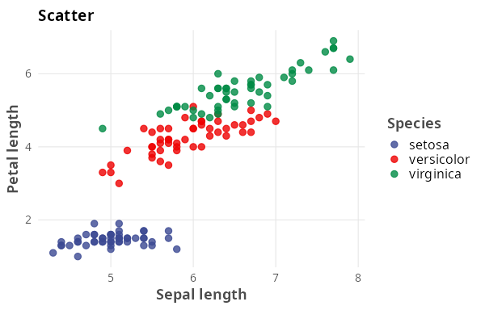
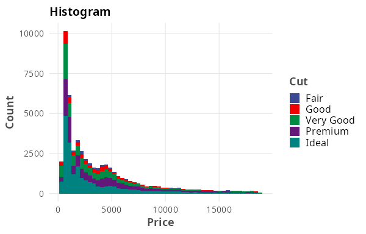
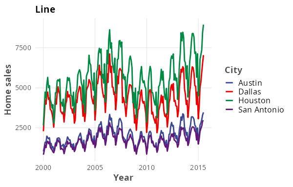
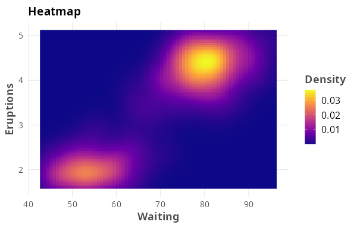
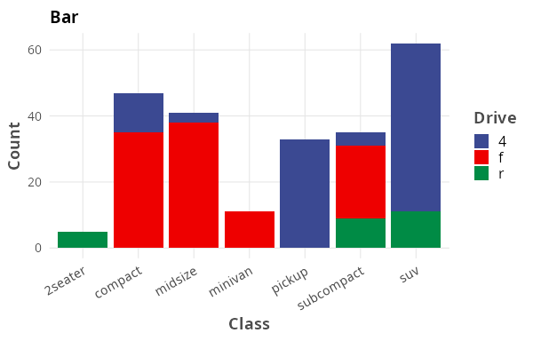
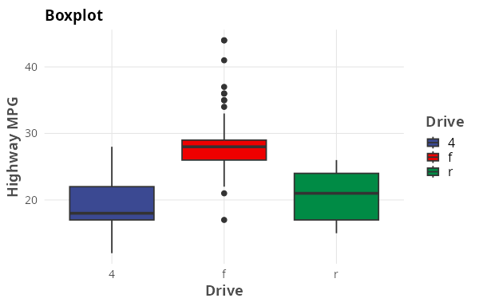
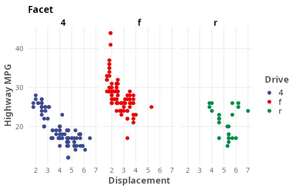
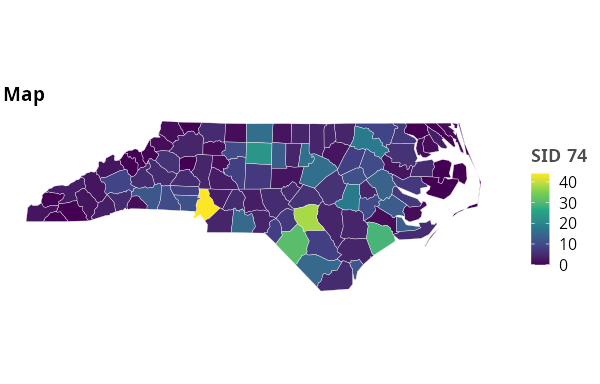
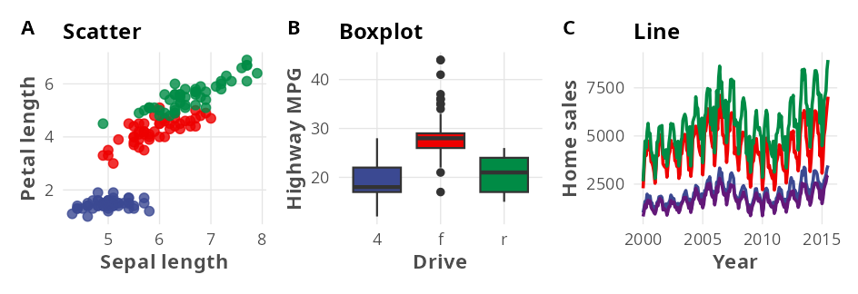

# themeKanso

A simple, clean ggplot2 theme. "Kanso" (簡素) means *simplicity*.
`theme_kanso()` extends `theme_minimal()` with reduced margins and grid lines
for an uncluttered look.

## Installation

```r
# from GitHub
remotes::install_github("TakaakiAokiWork/themeKanso")
```

## Usage

```r
library(ggplot2)
library(themeKanso)

ggplot(mtcars, aes(wt, mpg, colour = factor(cyl))) +
  geom_point() +
  labs(title = "themeKanso", subtitle = "Kanso") +
  theme_kanso()
```

`theme_kanso()` takes a base font size and family.

```r
theme_kanso(base_size = 14, base_family = "")
```

## Gallery

| | |
|---|---|
|  |  |
|  |  |
|  |  |
|  |  |

The gallery uses standard datasets (`iris`, `diamonds`, `txhousing`,
`faithfuld`, `mpg`, plus the `nc` shapefile bundled with [sf](https://r-spatial.github.io/sf/)),
the AAAS palette from [ggsci](https://nanx.me/ggsci/) for discrete scales, and
viridis for the continuous ones. The map uses `theme_kanso_map()`, a variant of
`theme_kanso()` for `geom_sf()` plots that drops the lat/long axes and
graticule. Regenerate with:

```r
Rscript data-raw/make_readme_figures.R   # requires ggsci, patchwork, sf
```

### Multi-panel layout

Three panels side by side at A4 text width (16 cm) with
[patchwork](https://patchwork.data-imaginist.com/). Panel tags from
`plot_annotation(tag_levels = "A")` are rendered bold and top-left by the theme.



## License

MIT License
